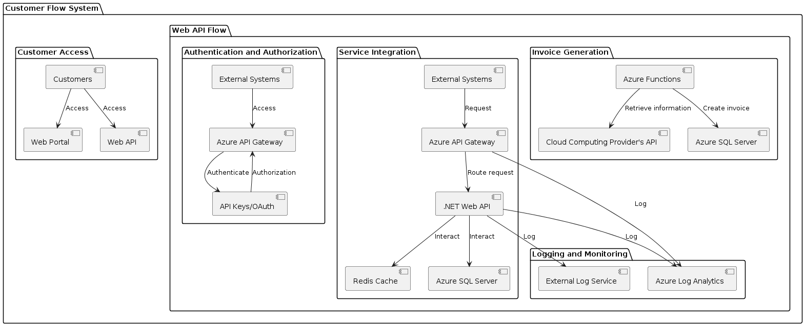

# Project Overview

Crayon aims to implement a cloud sales solution to cater to customers in Europe and APAC regions. This solution will utilize a business partner's Cloud Computing Provider (CCP) API to automate operations. Crayon intends to provide customers with two options for accessing services: a web portal and a web API, ensuring flexibility and seamless integration.

## Business Model

Crayon operates two types of sales businesses: Channel and Direct. Direct customers purchase and utilize software directly from Crayon, while re-sellers buy software from Crayon to sell to their customers (end-customers). End-customers can set up management accounts to access services, with each account capable of subscribing to multiple services.

## Data Model

- Crayon categorizes customers into Direct and re-sellers.
- End-customers can create management accounts and access services.
- Services are associated with quantities, indicating the number of allowed users.
- The CCP provides a service catalogue with available services and purchase prices.
- Billing information is retrieved from the CCP, segmented by end-customers and services.

## Key Services

- **Azure Traffic Manager**: Azure Traffic Manager is utilized to distribute incoming traffic across multiple regions, ensuring low-latency access for customers globally. It enables high availability and fault tolerance by automatically rerouting traffic from unhealthy endpoints.

- **Kubernetes Services**: Kubernetes orchestrates containerized applications, allowing for efficient management of varying workloads. It automates deployment, scaling, and operations, ensuring optimal resource utilization and resilience to handle dynamic demand effectively.

- **Azure SQL Server**: Azure SQL Server serves as the backbone of our data storage, providing a reliable and scalable solution for storing customer and service-related data. It offers built-in high availability, security, and performance tuning capabilities to meet the demands of modern cloud applications.

- **Redis Cache**: Redis Cache is implemented to enhance system performance and responsiveness by storing frequently accessed data in-memory. It reduces database load and latency, speeding up data retrieval and improving overall application performance.

- **Azure API Gateway**: Azure API Gateway acts as a central hub for managing, securing, and monitoring APIs. It provides features such as authentication, authorization, rate limiting, and traffic control, ensuring secure and efficient communication between clients and services.

- **Angular Frontend**: Angular Frontend is developed to create an intuitive and interactive web portal for customer interaction. It delivers a seamless user experience with its robust architecture, modular design, and rich UI components.

- **.NET Web API**: .NET Web API powers the backend infrastructure, enabling seamless integration for system-to-system communication. It provides a flexible and scalable platform for building RESTful APIs, facilitating data exchange and interoperability between different systems.

- **Azure Functions**: Azure Functions enable serverless computing, allowing us to execute code in response to events without managing infrastructure. They streamline processes, handle asynchronous tasks, and integrate with other Azure services to build scalable and cost-effective solutions.

- **Background Workers**: Background Workers are employed for asynchronous processing of tasks such as invoice generation and support case handling. They offload time-consuming operations from the main application thread, ensuring smooth and responsive user experience.

## Scaling Strategy ([text](https://kubernetes.io/))

Kubernetes is employed for scaling the system. It dynamically adjusts resources based on demand, ensuring optimal performance and resource utilization. Horizontal and vertical scaling techniques are utilized to handle fluctuations in workload effectively.

## Analytics and Logs

- **Azure Log Analytics**: Utilized for centralized logging, monitoring, and analysis of system performance and health.
- **External Log Service**: Optional integration with services like Betterstack([text](https://betterstack.com/logs)) or DataDog([text](https://docs.datadoghq.com/logs/)) for enhanced logging capabilities, monitoring, and reporting.

## High level architecture

## Web portal and system integration flow

#Deep dive to order service

## Data Model
### Customer

- **CustomerID**: Unique identifier for the customer.
- **Name**: Name of the customer.
- **Email**: Email address of the customer.
- **Type**: Type of customer (e.g., Channel, Direct).
*These fields are common to most of the models*
- **RowVersion**: Version control for data integrity.
- **CreatedBy**: User who created the record.
- **ModifiedBy**: User who last modified the record.
- **DateCreated**: Date and time when the record was created.
- **DateModified**: Date and time when the record was last modified.
- **IsDeleted**: Flag indicating if the record has been deleted.

### Account

- **AccountID**: Unique identifier for the account.
- **CustomerID**: Identifier for the associated customer.
- **AccountName**: Name of the account.
- **Email**: Email address associated with the account.

### Service

- **ServiceID**: Unique identifier for the service.
- **ServiceName**: Name of the service.
- **ExpirationDate**: Date when the service expires.
- **State**: State of the service (e.g., Active, Inactive).

### Licence

- **LicenceID**: Unique identifier for the licence.
- **LicenceKey**: Key associated with the licence.
- **ServiceID**: Identifier for the associated service.

### AccountSubscription

- **AccountSubscriptionID**: Unique identifier for the account subscription.
- **AccountID**: Identifier for the associated account.
- **ServiceID**: Identifier for the associated service.
- **SubscriptionDate**: Date when the subscription was created.

### Order

- **OrderID**: Unique identifier for the order.
- **CustomerID**: Identifier for the associated customer.
- **AccountID**: Identifier for the associated account.
- **OrderDate**: Date when the order was placed.

### Invoice

- **InvoiceID**: Unique identifier for the invoice.
- **OrderID**: Identifier for the associated order.
- **Amount**: Total amount of the invoice.
- **InvoiceDate**: Date when the invoice was generated.

## DB Scheme (sql included in resources folder)

## Future improvements
- Implement a queue service for orders to enhance resilience during failures.
- Integrate an identity provider for improved security and access control.
- Utilize HTTP Azure Functions for efficient document generation and storage.
- Enhance logging and tracking for comprehensive analytics and insights.
